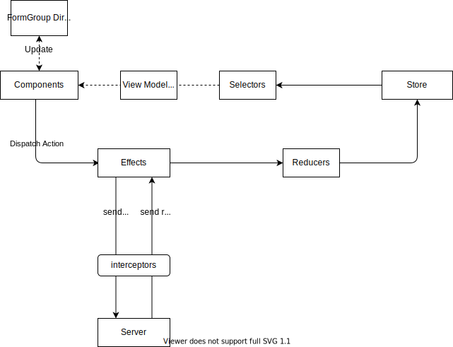

# Overview
The following diagram represents the overall general flow of application state


## Component

The component retrieve the data from [Store](#store) with [Selectors](#selectors). If the data structure is quite complex, we can add an extra  mapper layer to transform store data into a view model. This is very helpful to decouple the view model from the component. For example, I would create a view model for a complex form group. Each input field has its own form property model including `value`, `visible`, `validator` etc. When a input field's behavior is not expected, I cna easily identify which property of the input field causes the issues.

```typescript
export class Component extends AbstractConnectableComponent implements OnInit {
    constructor(
        private readonly store: Store,
    ) {
        super(cdr);
    }

    public ngOnInit(): void {
        this.connect<LoanChangesComponent>({
            applicationLoanRenewalOptions: this.store.select(ApplicationSelectors.renewalOptions),
            selectedLoanAccount: this.store.select(LoanAccountsSelectors.selectedLoanAccount),
        });
    }
}
```
## Actions
Actions are one of the important building blocks in NgRx. It's like a messengers carrying information being sent from one place to another. It's essentially a plain object. You use `ofType` operators to capture actions in NgRx. As such, it could be received by components, effects or reducers. 

Define a new action
```typescript
const fetchFee = createAction(
  '[fee][fetch]',
  props<{ feeId: string }>(),
);
```
## Store(State)
```typescript
export interface FeesState extends Synchronizable, EntityState<Fee> {}
```


## Selectors
Selectors are pure functions used for obtaining slices of store state. The selectors take advantage of  memoization for performance improvement.   Selectors provide many features when selecting slices of state:

- Portability
- Memoization
- Composition
- Testability
- Type Safety

```typescript
export const feesFeatureKey = 'fees';

const feesFeature = createFeatureSelector<FeesState>(feesFeatureKey);

const isSyncing = createSelector(feesFeature, feesState => feesState.isSyncing);

const fees = createSelector(feesFeature, feesState => values(feesState.entities));
```

## Effects
Capture action in effect and send request via service
```typescript
export class FeeEffects {
    public fetch$ = createEffect(() => this.actions$.pipe(
      ofType(FeesActions.fetchFee),
      withLatestFrom(this.store.select(ApplicationSelectors.applicationId)),
      mergeMap(([{ feeId }, applicationId]) => this.getFee$(applicationId, feeId).pipe(
        map(fee => FeesActions.fetchFeeSuccess({ fee })),
        catchError(() => of(FeesActions.fetchFeeError())),
      )),
  ));
}
```

## Reducers
Reducers in NgRx are responsible for handling transitions from one state to the next state in your application. Reducer functions handle these transitions by determining which actions to handle based on the action's type.
```typescript
export const feesAdapter: EntityAdapter<Fee> = createEntityAdapter<Fee>();
export const feesInitialState: FeesState = feesAdapter.getInitialState({
  isSyncing: false,
});

export const feesReducer = createReducer(
  on(
    FeesActions.fetchFeeSuccess,
    (state, { fee }) => {
      state = feesAdapter.upsertOne(fee, state);
      state.isSyncing = false;
      return state;
    }),
);
```

