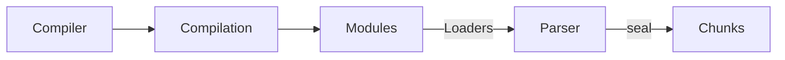
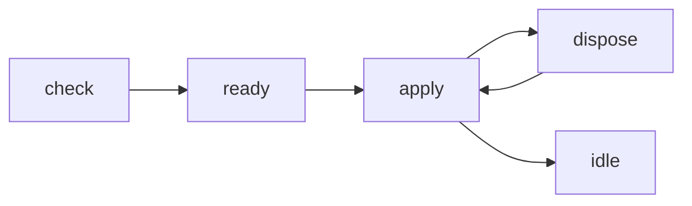

# Concepts
## Entry
An entry point indicates which module webpack should use to begin building out its internal dependency graph. 

## Output
The output property tells webpack where to emit the bundles it creates and how to name these files. It defaults to `./dist/main.js` for the main output file and to the `./dist` folder for any other generated file.

## Chunks
Chunks come in two forms:
- initial is the main chunk for the entry point. This chunk contains all the modules and its dependencies that you specify for an entry point.
- non-initial is a chunk that may be lazy-loaded. It may appear when dynamic import or SplitChunksPlugin is being used.

## Dependency Graph
Any time one file depends on another, webpack treats this as a dependency. This allows webpack to take non-code assets, such as images or web fonts, and also provide them as dependencies for your application.


## Compilation Process

1. initialization： read arguments, load plugins and instantiate `Compiler`
2. start compilation
3. find entry
4. compile modules and call corresponding loaders: The loader transpiles the match modules.
5. complete compilation
6. output resources and produce chunks
7. complete output: write files to system
8. Webpack broadcast different events throughout the process, the plugins subscribe the events will be called and change the final output.



### Compiler Object
Compiler is a singleton instance. It controls the whole bundling process. 
1. `acorn` library generates the `AST` tree for analyzing the relations of modules.
2. The final output is a `IIFE` function.
3. During the bundling process, modules are combined into chunks. Chunks combine into chunk groups and form a graph (ChunkGraph) interconnected through modules.

### Compiler Hooks
The Compiler module is the main engine that creates a compilation instance with all the options passed through the CLI or Node API. It is the context containing all information for bundling. Every hot reload and compiling, `compiler` creates a new `compilation` object. It extends the `Tapable` class in order to register and call plugins. Most user facing plugins are first registered on the Compiler. 

```js
compiler.hooks.someHook.tap('MyPlugin', (params) => {
  /* ... */
});
```

### Compilation Object
It's a manager for each single building process. When `watch=true`, the webpack only has one single `Compiler`. But each new compilation update, it will create a new `Compilation` object. 

### Compilation Hooks
The Compilation module is used by the Compiler to create new compilations (or builds). A compilation instance has access to all modules and their dependencies (most of which are circular references). It is the literal compilation of all the modules in the dependency graph of an application. During the compilation phase, modules are loaded, sealed, optimized, chunked, hashed and restored.

```javascript
compilation.hooks.buildModule.tap(
  'SourceMapDevToolModuleOptionsPlugin',
  (module) => {
    module.useSourceMap = true;
  }
);
```

### Hot Module Replacement
If Hot Module Replacement has been enabled via the HotModuleReplacementPlugin, its interface will be exposed under the module.hot property. 
```js
if (module.hot) {
  module.hot.accept('./library.js', function () {
    // Do something with the updated library module...
  });
}
```

#### Hot Module Replacement process




## Loader
Loaders allow webpack to process other types of files and convert them into valid modules that can be consumed by your application and added to the dependency graph.

1. **sync loader**
```javascript
/*
@param {string|Buffer} content Content of the resource file
@param {object} [map] SourceMap data consumable by https://github.com/mozilla/source-map
@param {any} [meta] Meta data, could be anything
*/
module.exports = function webpackLoader(content, map, meta) {
  // code of your webpack loader
}
```
2. **async loader**
```javascript
  module.exports = function webpackLoader(content, map, meta) {
      var callback = this.async();
      someAsyncOperation(content, function (err, result) {
          if (err) return callback(err);
          callback(null, result, map, meta);
      })
  })
```


## Plugin

### Creating a plugin
A plugin for webpack consists of:

A named JavaScript function or a JavaScript class.
Defines apply method in its prototype.
Specifies an event hook to tap into.
Manipulates webpack internal instance specific data.
Invokes webpack provided callback after functionality is complete.

```javascript
// A JavaScript class.
class MyExampleWebpackPlugin {
  // Define `apply` as its prototype method which is supplied with compiler as its argument
  apply(compiler) {
    // Specify the event hook to attach to
    compiler.hooks.emit.tapAsync(
      'MyExampleWebpackPlugin',
      (compilation, callback) => {
        console.log('This is an example plugin!');
        console.log(
          'Here’s the `compilation` object which represents a single build of assets:',
          compilation
        );

        // Manipulate the build using the plugin API provided by webpack
        compilation.addModule(/* ... */);

        callback();
      }
    );
  }
}
```

## Simplified Webpack
```javascript
function runtime(modules) {
	const module_cache = {};

	function webpack_require(id) {
		if (module_cache[id]) return module_cache;

		const module = module_cache[id] = {
			exports: {}
		};

		modules[id](module, module.exports, webpack_require);

		return module.exports;
	}

	return webpack_require(0);
}

function a(this_module, webpack_exports, webpack_require) {
	const exported = webpack_require(1);
	console.log(exported['default']);
}

function b(this_module, webpack_exports, webpack_require) {
	webpack_exports['default'] = 42;
}


runtime([a, b]);
```

### References
- [Webpack Documentation](https://webpack.js.org/)
- [Minipack](https://github.com/ronami/minipack)
- [Webpack Deep Dive(Chinese)](https://zhuanlan.zhihu.com/p/363928061)
