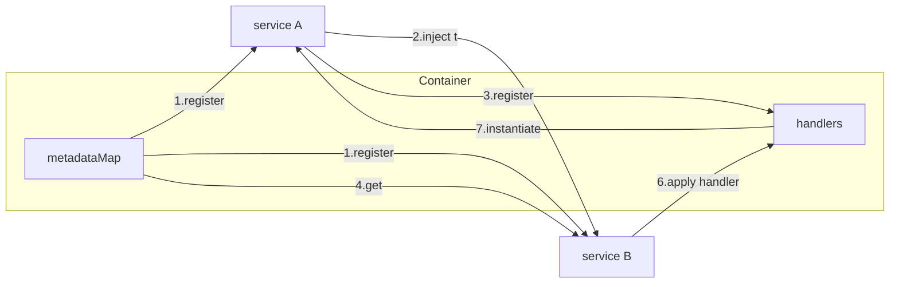

Decorator is very powerful feature in Typescript. It can add additional information or steps to support annotating or modifying. It empowers Typescript with AOP(Aspect-oriented-programming), DI (Dependency Injection) or even meta programming. It's widely used in Angular and Nestjs. If you are familiar with Java SpringBoot, you find them very similar. Whereas in Java,  Decorator is called Annotation.

To enable decorator feature, we need to enable `experimentalDecorators` in `tsconfig.json` first.
```json
{
  "compilerOptions": {
    "target": "ES5",
    "experimentalDecorators": true
  }
}
```
There are 5 types of decorators including Class Decorators, Method Decorators, Accessor Decorators, Property Decorators, Parameter Decorators. Each decorator has a slightly different group of parameters. If there are more than 1 type of decorators are added, they will be executed in a well defined order:

1. Parameter Decorators, followed by Method, Accessor, or Property Decorators are applied for each instance member.
2. Parameter Decorators, followed by Method, Accessor, or Property Decorators are applied for each static member.
3. Parameter Decorators are applied for the constructor.
4. Class Decorators are applied for the class.

For further information of decorators, you can visit this [official documentation](https://www.typescriptlang.org/docs/handbook/decorators.html#decorator-factories).

Here is a playground for Typescript decorators.

<iframe src="https://codesandbox.io/embed/green-mountain-yskzh?autoresize=1&fontsize=14&hidenavigation=1&theme=dark"
     style="width:100%; height:500px; border:0; border-radius: 4px; overflow:hidden;"
     title="green-mountain-yskzh"
     allow="accelerometer; ambient-light-sensor; camera; encrypted-media; geolocation; gyroscope; hid; microphone; midi; payment; usb; vr; xr-spatial-tracking"
     sandbox="allow-forms allow-modals allow-popups allow-presentation allow-same-origin allow-scripts"
   ></iframe>

## Dependency Injection
Dependency injection, or DI, is a design pattern in which a class requests dependencies from external sources rather than creating them. It's been widely used in Angular and Nestjs Framework.
In Angular, a service is created like this: 
```typescript
import { Injectable } from '@angular/core';

@Injectable({
  providedIn: 'root',
})
export class ServiceA {
  constructor() { }

  methodA() {

  }
}
```
The decorator `@Injectable` indicates that this service can be injected to other services or components. The metadata `provided: 'root'`, means that the service is visible throughout the application. 

```typescript
@Injectable({
  providedIn: 'root',
})
export class ServiceB {

  constructor(private serviceA: ServiceA) {  }

  methodB() {
      this.serviceA.methodA();
  }
}
```

### typedi
You might wonder how Dependency Injection works under the hood. I explored a project [typedi](https://github.com/typestack/typedi). It sheds light on how Dependency Injection takes advantage of decorators. In typedi, we can declare a injectable service like this.

### Basic Usage
```typescript
import {Container, Service} from 'typedi';

@Service()
class ExampleInjectedService {
  printMessage() {
    console.log('I am alive!');
  }
}
```

In the `Service` decorator, the metadata of the target class is registered in the `ContainerRegistry.defaultContainer`.

```typescript
export function Service<T>(options: ServiceOptions<T> = {}): ClassDecorator {
  return targetConstructor => {
    const serviceMetadata: ServiceMetadata<T> = {
      id: options.id || targetConstructor,
      type: (targetConstructor as unknown) as Constructable<T>,
      factory: (options as any).factory || undefined,
      multiple: options.multiple || false,
      eager: options.eager || false,
      scope: options.scope || 'container',
      referencedBy: new Map().set(ContainerRegistry.defaultContainer.id, ContainerRegistry.defaultContainer),
      value: EMPTY_VALUE,
    };

    ContainerRegistry.defaultContainer.set(serviceMetadata);
  };
}
```
`ContainerRegistry.defaultContainer` contains a `metadataMap`. It stores the registered class's metadata.


We request a new instance of `ExampleInjectedService` like this. The `get` method will either get an existing instance or initialize a new instance based on the eager and scope option.

```typescript
const serviceInstance = Container.get(ExampleInjectedService);
```

### Injected service in constructor
When the property is annotated with `@Inject()` decorator, it indicates that the injectedService should be retrieved from the Container.

```typescript
import { Container, Service } from 'typedi';

@Service()
class ExampleInjectedService {
  printMessage() {
    console.log('I am alive!');
  }
}

@Service()
class ExampleService {
    @Inject()
    private injectedService: ExampleInjectedService
  ) {}
}

const serviceInstance = Container.get(ExampleService);
serviceInstance.injectedService.printMessage();
```
The `Inject()` decorator registered the target class in the  array `handlers`.
```typescript
export function Inject(
  typeOrIdentifier?: ((type?: never) => Constructable<unknown>) | ServiceIdentifier<unknown>
): ParameterDecorator | PropertyDecorator {
  return function (target: Object, propertyName: string | Symbol, index?: number): void {
    const typeWrapper = resolveToTypeWrapper(typeOrIdentifier, target, propertyName, index);

    // The container creates a handler and add it to the array handlers.
    ContainerRegistry.defaultContainer.registerHandler({
      object: target as Constructable<unknown>,
      propertyName: propertyName as string,
      index: index,
      value: containerInstance => {
        const evaluatedLazyType = typeWrapper.lazyType();

        return containerInstance.get<unknown>(evaluatedLazyType);
      },
    });
  };
}
```

When we call `Container.get(ExampleService)`, it will also run `applyPropertyHandlers` function which instantiated the property based on the class.
```typescript
/**
   * Applies all registered handlers on a given target class.
   */
private applyPropertyHandlers(target: Function, instance: { [key: string]: any }) {
    this.handlers.forEach(handler => {
      if (handler.propertyName) {
        instance[handler.propertyName] = handler.value(this);
      }
    });
  }
```

The following graph illustrates how the injected service is instantiated.




## Class Validator
## Routing Controller

Add the action to `MetadataArgsStorage`;
```typescript
export function Get(route?: string | RegExp, options?: HandlerOptions): Function {
  return function (object: Object, methodName: string) {
    getMetadataArgsStorage().actions.push({
      type: 'get',
      target: object.constructor,
      method: methodName,
      options,
      route,
    });
  };
}
```

```typescript
createExecutor(driver: T, options: RoutingControllerOptions = {}): void {
    return  new RoutingControllers(driver, options)
    .initialize()
    .registerInterceptors(interceptorClasses)
    .registerMiddlewares('before', middlewareClasses)
    .registerControllers(controllerClasses)
    .registerMiddlewares('after', middlewareClasses); 
}
```

Register the actions of controllers to driver;
```typescript
registerControllers(classes?: Function[]): this {
    const controllers = this.metadataBuilder.buildControllerMetadata(classes);
    controllers.forEach(controller => {
      controller.actions.forEach(actionMetadata => {
        const interceptorFns = this.prepareInterceptors([
          ...this.interceptors,
          ...actionMetadata.controllerMetadata.interceptors,
          ...actionMetadata.interceptors,
        ]);
        this.driver.registerAction(actionMetadata, (action: Action) => {
          return this.executeAction(actionMetadata, action, interceptorFns);
        });
      });
    });
    this.driver.registerRoutes();
    return this;
  }
```

```typescript
registerAction(actionMetadata: ActionMetadata, executeCallback: (options: Action) => any): void {
  this.express[actionMetadata.type.toLowerCase()](
      ...[route, routeGuard, ...beforeMiddlewares, ...defaultMiddlewares, routeHandler, ...afterMiddlewares]
    );
}
```

## Reflect-metadata
